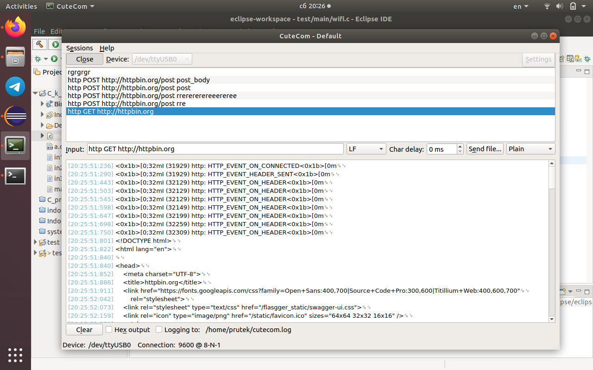
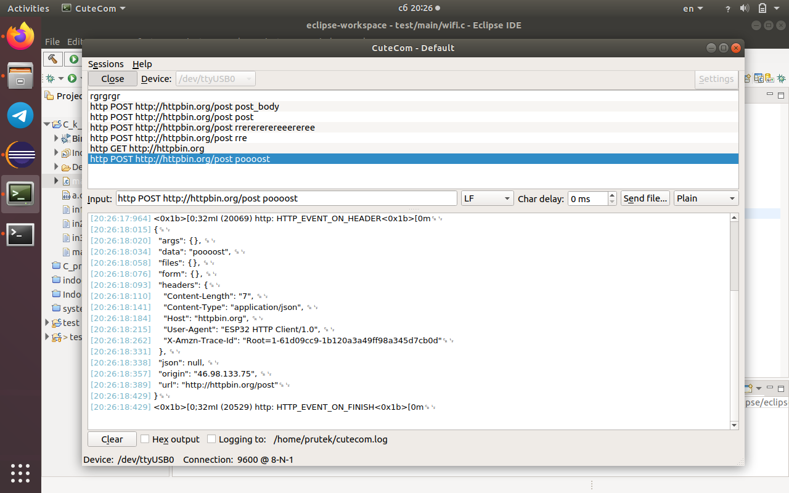

## Test project 
Write a terminal program to send HTTP requests to the remote server.
  Program should:
- connect to the WiFi
- get commands from the console
- send requests to the server
- output responses to the console.

## How it works
- main.c - main program, contain work with console(uart) and using wifi and http modules.
- wifi.c - connect to wifi. Defines WIFI_SSID and WIFI_PASS are used to enter your wifi name and password.
- http.c - send post and get requests to server.

## Examples
**Get request:**
   
  
**Post request:**
   
